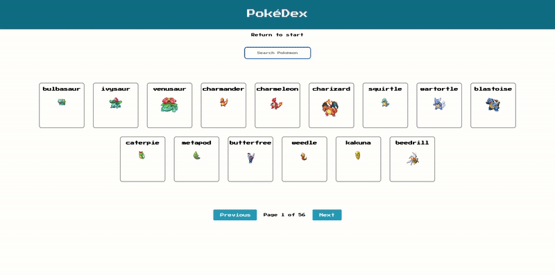
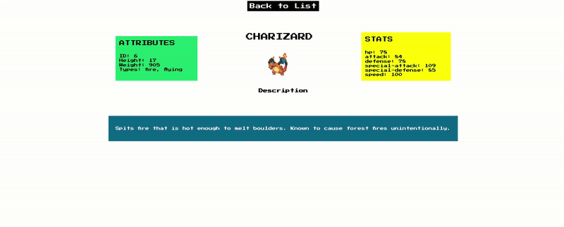

## 📘 Beskrivning
Detta är en Pokédex byggd med React och TypeScript. Användaren kan söka efter Pokémon, visa detaljer och filtrera efter typ.

# 🎮 Pokédex app

Intro page

Page swtiching and filtering Pokémon 

Pokémon Stats and attributes

## 🔧 Tekniker som används
- React / TypeScript
- REST API (PokéAPI)
- SCSS Modules

## 🚀 Funktioner
- 🔍 Sök Pokémon
- 📖 Visa detaljerad info
- 🎨 Filtrera efter typ
- 📱 Responsiv design

## 🧠 Lärdomar
- Jag fick en djupare förståelse för hur man hämtar och hanterar data från ett REST API (PokéAPI).  
- Jag lärde mig att använda TypeScript för att skapa tydliga typer och gränssnitt, vilket minskade buggar och gjorde koden mer robust.  
- Jag utvecklade mina kunskaper i komponentbaserat tänkande med React, och hur man bryter ner en applikation i mindre, återanvändbara delar.  
- Jag fick erfarenhet av att arbeta med **state management** och hur man hanterar asynkrona anrop med `useEffect` och `useState`.  
- Jag övade på att bygga en **responsiv design** med SCSS Modules, så att applikationen fungerar på både desktop och mobil.  
- Jag insåg vikten av att strukturera projektet och hålla en tydlig mappstruktur för att underlätta vidareutveckling.  

### Vad jag hade gjort annorlunda
- Implementerat en mer avancerad state-hantering (t.ex. Redux eller Context API) för bättre skalbarhet.  
- Lagt till enhetstester för att säkerställa att centrala funktioner fungerar som de ska.  
- Förbättrat prestandan genom att optimera API-anrop (exempelvis caching av Pokémon-data).

## 🔗 Länkar
- 💻 [Live-demo](https://pokedex-git-master-intis-projects-4184abf2.vercel.app/)
- 📂 [Repo](https://github.com/Reyuuh/PokeDex.git)
