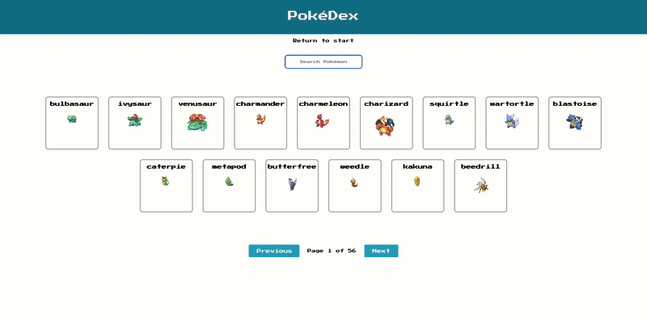
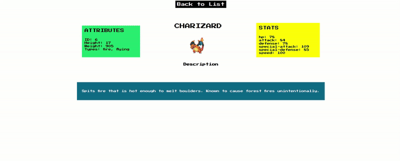

# 🎮 Pokédex App

A fully-featured Pokédex built with React and TypeScript, powered by the [PokéAPI](https://pokeapi.co/). Browse all 1,025 Pokémon with smooth infinite scroll, filter by type and generation, and dive into detailed stat pages styled after a classic Pokédex.

---

## ✨ Features

- **Landing page** — animated gradient background with floating Pokéballs, a randomly featured Pokémon on every visit, and its Pokédex entry as a fun fact
- **Infinite scroll** — lazy loads Pokémon in batches of 20 with smooth staggered fade-in animations
- **Filter by type** — 18 type pills with vibrant colours
- **Filter by generation** — Gen I through Gen IX, filtered instantly client-side by ID range
- **Sort options** — by ID (ascending/descending) or name (A→Z / Z→A)
- **Hover cards** — hover any Pokémon card to preview its types, abilities, height and weight
- **Type-coloured cards** — each card is tinted and bordered by its primary type colour
- **Pokémon detail page** — full Pokédex-style layout including:
  - Animated pixel-art or official artwork sprite
  - Base stats with animated fill bars
  - Abilities (including hidden)
  - Pokédex flavor text entry
  - Training info (growth rate, base EXP, capture rate)
  - Breeding info (gender ratio, egg groups, habitat, generation)
- **Prev / Next navigation** — floating side arrows on the detail page to browse through Pokémon
- **Search** — live search by name with empty state feedback
- **Alternate form support** — newer generation Pokémon and alternate forms (IDs 1000+) load correctly using the species URL from the API response
- **Responsive design** — works on mobile and desktop

---

## 🛠 Tech Stack

- **React** + **TypeScript**
- **SCSS** — modular architecture with shared `_variables`, `_mixins`, `_reset`, and `_animations` partials
- **React Router** — client-side routing
- **PokéAPI** — REST API for all Pokémon data
- **Context API + useReducer** — global state management
- **IntersectionObserver** — infinite scroll / lazy loading

---

## 📸 Preview

**Landing Page**


**Browsing & Filtering**



**Pokémon Detail Page**



---

## 🚀 Getting Started

```bash
npm install
npm run dev
```

---

## 🔗 Links

- 💻 [Live Demo](https://pokedex-git-master-intis-projects-4184abf2.vercel.app/)
- 📂 [Repository](https://github.com/Reyuuh/PokeDex.git)
